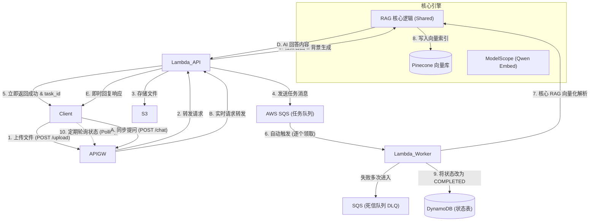
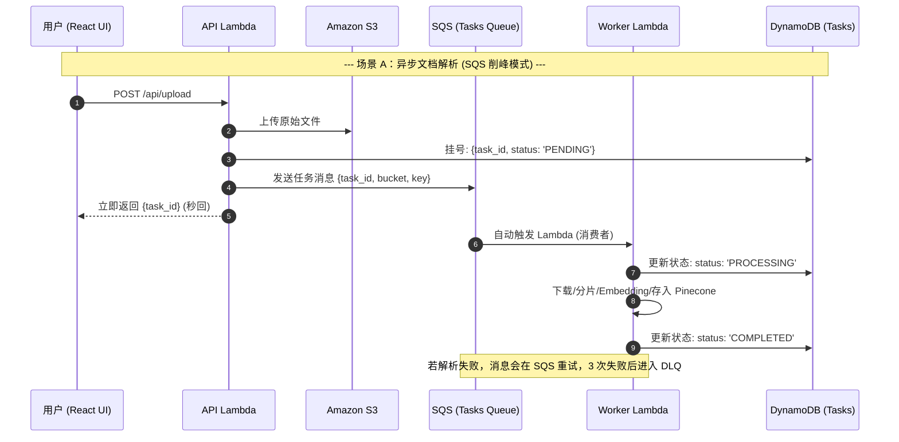

# 🏗️ AWS NotebookLM 异步 RAG 架构深度解析 (SQS 升维版)

本文档详细介绍了本项目为了实现**商业级稳定性**而采用的 **“负载均衡与异步消峰 (Load Leveling)”** 架构。核心变更在于引入了 **AWS SQS** 消息队列作为中转站。

## 1. 核心架构拓扑图

目前系统采用 **请求-响应-对账 (Request-Reply-Reconciliation)** 模式：

## 2. 详细时序图 (Sequence Diagram)

## 3. 为什么引入 SQS？(商业级考量)

相比于原始的“S3 直接触发 Lambda”，引入 SQS 带来了以下核心优势：

1.  **负载平衡 (Load Leveling)**：如果 100 个用户同时上传，SQS 会起到“蓄水池”作用。我们可以通过设置 Lambda 的 `Reserved Concurrency` 或 SQS 的 `BatchSize`，让后台按稳定的速率处理任务，不会冲垮下游的向量数据库或模型 API。
2.  **内置重试机制**：由于 RAG 解析涉及网络请求（ModelScope/Pinecone），偶尔会失败。SQS 支持自动重试，失败的消息会留在队列中等待下次处理，无需人工干预。
3.  **死信队列 (DLQ) 隔离**：如果一个文件损坏导致解析反复失败，它最终会进入 DLQ。这样我们可以保护系统不被“毒丸消息”死循环耗尽资源，并方便事后审计。
4.  **架构解耦**：API 只需确认“消息已入队”即可返回，任务的执行完全不依赖于 API 网关的状态。

## 4. 架构优势总结

1.  **彻底告别 29s 超时**：API 入口只负责“接活”，重活不占着网关连接。Worker Lambda 有最长 15 分钟的执行权。
2.  **高容错性**：即使后台处理崩溃，任务状态也会记录在 DynamoDB 中，方便排查死因（CloudWatch Logs）。
3.  **高并发支持**：支持瞬时高流量，不因后端处理缓慢而阻塞 API。
4.  **成本透明**：SQS 每月前 100 万次请求免费，完美契合 Free Tier。

## 5. 核心术语
*   **Decoupling (解耦)**：生产者和消费者互不相识，通过消息传递。
*   **DLQ (Dead Letter Queue)**：处理失败后的“垃圾回收站”。
*   **Visibility Timeout (可见性超时)**：确保同一条消息不会同时被两个 Worker 处理。
