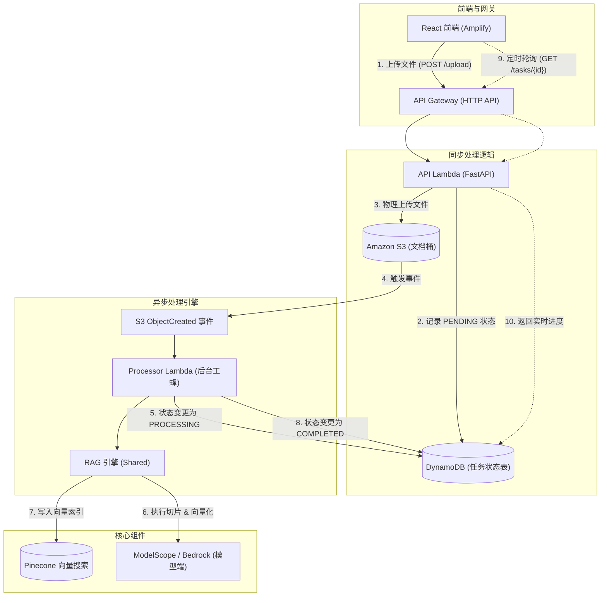
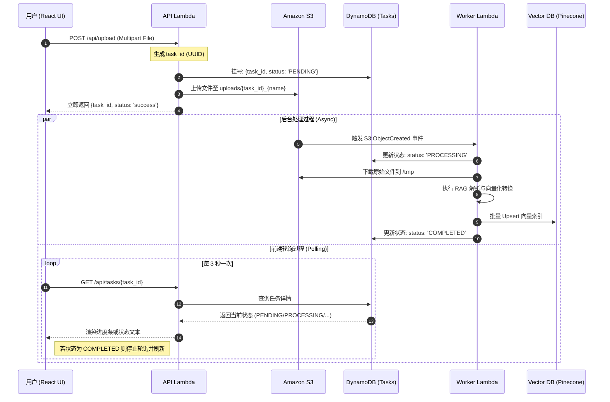

# 🏗️ AWS NotebookLM 异步 RAG 架构深度解析

本文档详细介绍了本项目为了解决 API Gateway 29 秒超时限制而采用的**异步轮询 (Asynchronous Polling)** 架构。该架构不仅提升了系统的稳定性，也为高负载的 RAG（检索增强生成）任务提供了无限的扩展空间。

## 1. 核心架构拓扑图

目前系统采用 **事件驱动 (Event-Driven)** 的 Serverless 模式：

## 2. 详细时序图 (Sequence Diagram)

展示了从用户点击上传到看到结果的完整生命周期：

## 3. 架构优势总结

1.  **彻底告别 29s 超时**：API 入口只负责“接活”，重活不占着网关连接。Worker Lambda 有最长 15 分钟的执行权。
2.  **极高容错性**：即使后台处理崩溃，任务状态也会记录在 DynamoDB 中，方便排查死因（CloudWatch Logs）。
3.  **零成本待机**：不上传文件时，没有任何计算资源在运行，完美符合 Serverless 精神。
4.  **扩容简单**：如果将来需要 LINE 回调，只需在 Worker 结尾加一行 LINE Push 调用，完全不需要改动 API 逻辑。

## 4. 核心术语表
*   **Polling (轮询)**：前端主动询问后端“好了没？”。
*   **Producer/Consumer (生产者/消费者)**：API 是生产者，Worker 是消费者。
*   **Idempotency (幂等性)**：使用 `task_id` 确保同一个文件上传不会产生重复的无效任务。
