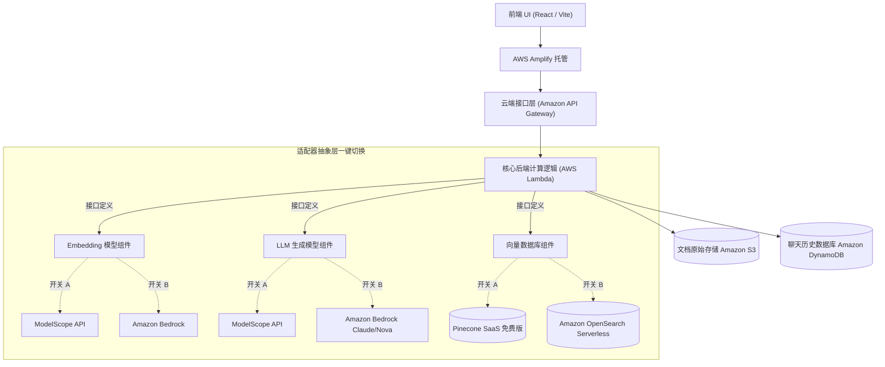
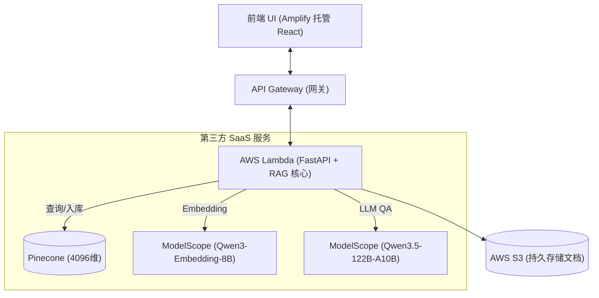
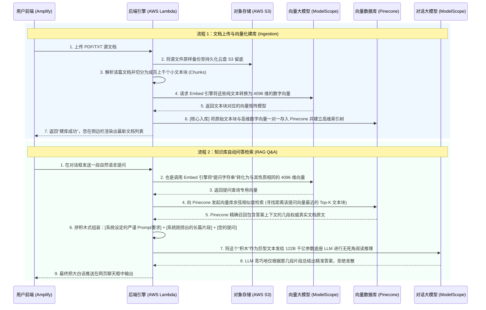
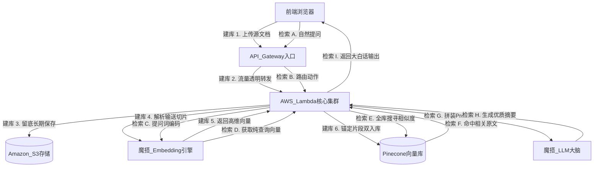

# 项目开发计划：基于 AWS 的 NotebookLM 替代品 (统一云原生版)

目标：开发一个类似于 NotebookLM 的个人知识库问答工具 (RAG系统)。
核心策略：**基础设施（存储、计算、前台）一步到位直接采用 AWS 原生服务**。但在“模型推理”和“向量数据库”这两块成本最敏感的区域，代码中内置双向适配器（Toggle），支持通过配置参数在免费版和纯 AWS 昂贵版之间无缝一键切换。

## 1. 架构设计图

架构的主体运行在 AWS 的无服务器（Serverless）生态之上。



### 核心组件说明
1. **前端 (Amplify + React/Vite)**：提供美观的文件上传和聊天对话 UI 界面。
2. **后端逻辑 (API Gateway + Lambda)**：提供无状态的 HTTP API。Lambda 内使用 LangChain 的架构来统筹处理文本读取、切分、向量化和 RAG 提示拼接。
3. **长期存储 (S3 + DynamoDB)**：S3 用于长久保存用户上传的 PDF，DynamoDB 用来管理跨 session 的聊天记忆上下文。
4. **灵活抽象层**：代码设计使用 `Service Adapter Pattern`。在配置文件（如 AWS Systems Manager 或 `.env`）中写入 `LLM_PROVIDER=modelscope` 或 `VECTOR_DB=pinecone` 即可选择便宜的路径；写入 `LLM_PROVIDER=bedrock` 即可使用纯血 AWS 方案。

---

## 2. 费用估算 (每月成本)

基于该全上云架构，您的每月费用将完全取决于您的“开关”状态。如果以个人练习（低频调用）为计：

| AWS 云资源模块 | 使用频次假设 | 预估成本 | 备注说明 |
| :--- | :--- | :--- | :--- |
| **AWS Amplify (前端)** | < 1GB 流量传输 | **$0** | 在 AWS Free Tier 内 |
| **AWS Lambda & API GW** | 几千次请求 / 月 | **$0** | API GW 免费前 1M 次；Lambda 免费前 400K GB-S |
| **Amazon S3 (文档)** | 存储 < 1GB PDF | **< $0.05** | 每 GB 月度存储费 $0.023 |
| **Amazon DynamoDB (历史)** | 读写较少 | **$0** | 免费额度含 25GB 存储及足够读写量 |
| **=== 模型层切换开关 ===** | | | |
| 🔀 **ModelScope (LLM+Embed)** | 依托您的免费额度 | **$0** | 适用于前期测试 |
| 🔀 **Amazon Bedrock** | 约2百万输入/50万输出 | **$3 ~ $12** | Claude 3.5 Sonnet 单价较高，Nova 相对便宜 |
| **=== 向量库切换开关 ===** | | | |
| 🔀 **Pinecone (SaaS)** | 单一索引，限制维度 | **$0** | Free 账号容量完全满足个人练习 |
| 🔀 **AWS OpenSearch Serverless**| 持续运行的最小双节点 | **至少 $150 ~ $300** | **高能警告：即便没有访问也会产生底层闲置资源扣费，一旦开启必须自行销毁。** |

**💡 费用总结与建议：**
- 日常开发测试组合（**0 成本**）：`Amplify + API GW + Lambda + S3 + DynamoDB` + **ModelScope** + **Pinecone**
- 终极纯血 AWS 体验（体验后须立刻关闭）：`Amplify + API GW + Lambda + S3 + DynamoDB` + **Bedrock** + **OpenSearch**

---

## 3. 开发路线图

1. **Phase 1：全栈基建与免费轨道跑通**
   - 建立 Vite + React 前端并打通 AWS Amplify 部署流程。
   - 编写并部署 AWS Lambda 的基础框架、连接 S3 和 DynamoDB。
   - 实现适配器代码：优先实现 `ModelScope` 和 `Pinecone` 接口，并跑通前后端端到端 RAG 聊天流程。

2. **Phase 2：植入纯血 AWS 组件代码**
   - 完善 LLM/Embedding 接口，加入 Amazon Bedrock 的实现代码 (Claude / Titan)。
   - 完善 Vector 接口，加入 Amazon OpenSearch Serverless 的实现代码。
   - 彻底确认可以通过系统环境变量一键控制双轨道切换。

---

## 4. 作业实际状况 (截至目前)

### 已完成任务概览
1. **基础设施架构设计**：确认了基于 AWS Serverless 的分层架构，并完成了云原生与开源双轨驱动的适配器抽象设计。
2. **前后端分离开发**：
   - **前端**：React + Vite 实现了支持多模态文件的响应式毛玻璃 UI（加入左侧知识库文件列表与对话框）。
   - **后端**：FastAPI + Mangum 构建了处理上传文件、分块解析及向量检索对话的核心 API。
3. **原生存储对接**：打通了 AWS S3 文件持久化上传，利用本地内存展示解析缓存结果。
4. **模型与向量引擎集成**：
   - 成功接入 Pinecone 免费版 Serverless 向量数据库。
   - 成功接入阿里 ModelScope（魔搭社区）的开源大模型：文本生成使用 `Qwen/Qwen3.5-122B-A10B`，Embedding 使用 `Qwen/Qwen3-Embedding-8B`（4096维）。
5. **云端自动化部署 (CI/CD)**：
   - **后端**：配置了基于 Serverless Framework v3.x 的 GitHub Actions，将 FastAPI 自动打包并发布至 AWS Lambda & API Gateway。
   - **前端**：将本地硬编码 URL 改造为环境变量字典，实现了与 AWS Amplify 的 GitHub webhook 全自动拉取源码构建部署集成。

### 最新架构图与系统工作流

为了更直观地理解，我们将原本并列的静态架构图拆分为**部署依赖视图**与**核心执行工作流视图**两部分：

#### 1. 静态基础设施部署视图 (依赖关系)



#### 2. 系统核心数据流转图 (RAG 工作流)

以下流程序列图清晰展示了“上传建库”与“检索问答”两条核心主线中，每一个网关与组件触发的真正逻辑与先后流转顺序：



#### 3. 跨实体系统综合拓扑图 (直连线与数据流向)

这也是最适合整体打包讲解的“全景连线图”。我们用蓝色**实线**代表文档进场被切成碎片的【上传入库管道】，用红色**虚线**代表向大模型询问提款的【检索问答管道】：



### 今日开发历程：遇坑与解决方案 🐛

1. **FastAPI 表单上传崩溃 (`RuntimeError`)**
   - **问题**：后端缺失处理 `UploadFile` 表单流的依赖。
   - **解决**：在 `requirements.txt` 中补充安装 `python-multipart` 解析器。
2. **S3 流式上传引发 `I/O operation on closed file`**
   - **问题**：文件游标被 FastAPI 协程上下文提前物理关闭，导致后续交接给 RAG 引擎时读取失败报错。
   - **解决**：巧妙地使用 `await file.read()` 将文档字节流全部提前载入常驻内存后，再分别分发给本地磁盘缓冲区与 Boto3 客户端持久化。
3. **Pinecone 官方 SDK 破坏性更新引发模块冲突**
   - **问题**：旧版包名 `pinecone-client` 被官方紧急废弃引发各种导入失败。
   - **解决**：利用终端大范围卸载了旧包缓存，干净地替换为最新的 `pinecone` 和 `langchain-pinecone`，并对内部适配器库的类进行升维重构。
4. **向量库维度不对等拦截写入 (`Vector dimension 4096 does not match 1536`)**
   - **问题**：更换多模态的 `Qwen3-Embedding-8B` 引擎后，其独有的 4096 高维输出被最初定死的 1536 维 Pinecone 索引仓库拒收拦截。
   - **解决**：要求管理员前往 Pinecone 云端控制台将旧库粉碎重建，将其骨架设定参数精确匹配为 `4096` 维。
5. **魔搭开源名字校验严苛无法唤醒 LLM (`Invalid model id: qwen-plus`)**
   - **问题**：偷懒使用百炼别称 `qwen-plus` 遭遇魔搭严格原生接口系统拦截返回 HTTP 400。
   - **解决**：重新定位魔搭社区真实存在的巨无霸级千亿开源仓库物理路径 `Qwen/Qwen3.5-122B-A10B` 进行发版替换。
6. **无意触碰 GitHub 安全高压线惨遭退回 (Push Protection)**
   - **问题**：开发初期不慎将装有 `AWS_ACCESS_KEY_ID` 云端账号密码的 `.env` 随身行李打包试图塞入远程代码库，被 Git 扫描器紧急迫降。
   - **解决**：手写 `.gitignore` 文件设立严格安检岗，并启动 `git rm --cached` 及 `git commit --amend` 原地洗白消除泄密犯罪历史后成功安全推入远端。
7. **Serverless Framework V4 商业霸权引爆 CI 瘫痪**
   - **问题**：由于该基建工具近期突然取消天下白嫖权限并且要求输入验证 License，导致 GitHub Actions 黑盒 Linux 构建服务器集体崩溃停摆。
   - **解决**：连夜抢修 CI/CD 自动化流水线，将下载核心指令锁死在该框架历史最强纯血开源旧版：`npm install -g serverless@3`。
8. **云端打工人账号越权报错被制裁**
   - **问题**：云端自动部署账号执行过程中爆红 `not authorized to perform: cloudformation...`。
   - **解决**：前往 AWS IAM 配置中心，简单粗暴赋能颁发了 `AdministratorAccess` 上帝权杖，扫除了其搭建网关、Lambda 函数甚至 Log 权限上的所有繁文缛节。
9. **惊险：AWS Lambda 极其隐蔽的 250MB 物理死硬红线 (`No module named 'fastapi'`)**
   - **问题**：为跳过压缩包造成的找不到路径问题干脆取消自动压缩（`zip: false`），怎料挂载的 LangChain、Pinecone 机器学习巨型依赖库解压后彻底撑爆亚马逊规定的上限，触发底层物理切割造成上线环境四分五裂集体报出 500 断联！
   - **解决**：再次拥抱打包即压缩的真理（回归 `zip: true` 控制在小几十兆），同时在核心中枢 `app.py` 顶层级物理注入监听器：`import unzip_requirements`，使其可以在内存中高速自释放。
10. **致命 C 语言底层库版本不兼容 (`GLIBC_2.28 not found`)**
   - **问题**：AI 分词器核心库 `tiktoken` 包含 C 扩展，GitHub Ubuntu 构建机使用的底层 `GLIBC` 版本较新，而原定的 AWS Lambda `python3.11` 运行在古老的 Amazon Linux 2 (其 glibc 仅为 2.26) 上，执行时因找不到对应的底层动态链接库而当场报废。
   - **解决**：釜底抽薪，在 `serverless.yml` 与自动化发布 YAML 中，将基础运行环境双双强行升级为 `python3.12`，以此强制要求 AWS Lambda 为我们开启使用现代版 Amazon Linux 2023 的系统容器（GLIBC 2.34），实现降维打击，瞬间解决全部二进制兼容报错。
11. **默认运行时仅 6 秒遭遇无情截断 (`Status: timeout`)**
   - **问题**：成功解析文档并进入 Embedding 向量化阶段时，由于网络请求网络和魔搭社区大模型接口需要一定耗时，直接触及了 AWS Lambda 万年不变的默认 6 秒执行上限，被强制物理熔断导致用户端显示 HTTP 500。
   - **解决**：在 `serverless.yml` 的 `provider` 全局层级显式挂载了 `timeout: 29`，与云端 API Gateway 网关的最大容许发呆时间（29秒）精确对齐，赋予了 RAG 充足的计算时空。

### 最新资源准备与配置指南 (环境依赖基建手册)

为顺利运行本项目，全栈需要配置三大核心基座的准入密钥与系统环境：
1. **获取 AWS IAM 自动化发版凭证**
   - 进入 AWS IAM (Identity and Access Management) 控制台，新增程序化访问用户（例如 `notebooklm-dev-user`）。
   - 为该用户赋予 `AdministratorAccess`（为确保能够顺利创建 API Gateway 及触发 CloudFormation，建议最高权限）。
   - 生成后，获取并稳妥保管 **`AWS_ACCESS_KEY_ID`** 和 **`AWS_SECRET_ACCESS_KEY`** 以及对应的 `AWS_REGION`。
2. **阿里魔搭 (ModelScope) 平台模型访问鉴权**
   - 前往魔搭社区官网注册阿里云账号体系并登录。
   - 在控制台中生成长期有效的 **`MODELSCOPE_API_KEY`** 以便解锁大模型白嫖额度。
3. **Pinecone 向量数据库初始索引建立**
   - 注册免费 SaaS 版 Pinecone。
   - 必须提前在后台创建一个 Index 索引实例，要求：**Dimension（维度）严格设置为 `4096`**（以匹配本文独家定制的 Qwen3-Embedding-8B 多模态引擎），Metric 选择 `cosine`。
   - 进入 API Keys，获取专属密码 **`PINECONE_API_KEY`** 与上述创建的库名称 **`PINECONE_INDEX`**。

以上所有密码素材，必须在 GitHub 项目仓库的 **Settings -> Secrets and variables -> Actions** 中逐一配置，彻底打通零接触自动化发版流水线。

### 核心项目代码结构规范

```text
aws_notebooklm/
├── frontend/                     # AWS Amplify 托管的 React 前端应用
│   ├── src/
│   │   ├── App.tsx               # ⭐ 前端页面的核心状态逻辑、对话窗渲染与接口交互神经中枢
│   │   ├── App.css / index.css   # 全局毛玻璃磨砂质感与响应式弹性盒子的像素级实现
│   │   └── main.tsx              # 前端渲染总入口
│   ├── index.html                # 单页面应用主体 HTML 底座
│   ├── package.json              # 锁定了 Vite 及 React 的前端生态依赖
│   └── vite.config.ts            # 前端打包管道及 AWS 环境变量探针注入配置
├── backend/                      # 部署于 AWS Lambda 的 FastAPI RAG 雷达引擎
│   ├── app.py                    # ⭐ 后端大脑：接收网络流量分发上传任务、文档分本块调度处理、RAG检索提问链闭环
│   ├── adapters.py               # AWS Bedrock/魔搭“双轨制”抽象接口工厂底座，定义具体模型发版路径
│   ├── serverless.yml            # CI自动化发布神级部署文件（定义了3.12运行时、API权限放行、250MB体积突破锁）
│   └── requirements.txt          # 构建大模型体系底层 Python 网格的死硬版本锁链
└── .github/workflows/            # 统管整个架构生态的流控发布监听机制文件
```

### 现阶段云端账单分析与防超支估算

在跑完免流配置管道后，由于我们采取了**分离模型端至免费开源 SaaS**（魔搭与 Pinecone）的架构策略，本项目尽管完全置于 AWS 真实生产云端上，但所调用的**均属首年/永久合规 Free Tier（免费套餐）范畴**之列：
- **AWS Amplify (前端页托管 CDN)**：静态资源加载速度全球加速，每月首个 15GB 流量免费，普通开发者几近零感知。
- **Amazon API Gateway v2**：每月首发前 100 万次 API 请求免费。开发测试期开销死锁 `$0`。
- **AWS Lambda (Python 3.12计算层)**：AWS 默认赠送庞大的每月 40 万 GB-秒计算空间。即便我们在 Embedding 操作偶尔触及高发呆秒数上限（20多秒/次），极度充足的池子资源也能完美覆盖。
- **Amazon S3**：持久化存放不超过 5GB 大小的文档，在首年内处于 `$0` 计费区间，后续若超容仅以每 GB 两毛钱（RMB）单价代收。

**最终结论：只要未一键主动拨动环境变量强制切回纯血原生架构（如深不见底的 OpenSearch Serverless 与按单词计费的顶配版 Bedrock Claude/Nova），维持这个极高响应质量的模型平台常态运转的整体成本稳定为：每月 $0！**

### CI/CD 自动化黑盒部署双轨拓扑 (前后端分离)

针对前后端异构的特点，本项目采取了泾渭分明的“双管道”自动化发版方案：

#### 1. 前端自动化：无形钩子 (AWS Amplify 极速托管)
在此您可能感到疑惑，为何我的前端应用没有在 `.github/workflows` 中写入任何打包脚本，它却能自我更新发版？这是因为我们直接借用了云大厂 **AWS Amplify** 最高级别的黑盒 Webhook 托管能力：
- **原理级流转**：当您在 AWS 开发控制台点击创建 Amplify 应用时，AWS 已直接以超级应用身份扫描并绑定了您的 GitHub 仓库 `aws_notebooklm`。
- **触发扳机**：每次只要您向 `main` 主分支发起任何 `git push` 合并，GitHub 就会向 AWS 总部发送一条高度加密的 Webhook 过电信号。
- **云端组装**：AWS Amplify 捕获高压信号后，会瞬间隐形剥离出您的前端源码，扔进其遍布全球的云端密闭构建舱内怒砸 `npm run build`，随即将打包出来的终极 HTML 静态产物无缝抛洒到 AWS 王牌级的全球 CDN 加速节点上。这一切纯云端完成，您只看到绿灯亮起，代码便已上线。

#### 2. 后端自动化：指令级劫持 (GitHub Actions + Serverless 魔法)
相对于纯静态的前端，后端可是承载了 FastAPI、Boto3 网关劫持以及数以百兆计的模型调度重器，因此必须使用严格自定义的 GitHub Actions 流水线重兵压境：
- **原理级流转**：我们利用项目最底层的 `.github/workflows/backend-deploy.yml` YAML 文件，强行下发军令状，征用了一台由 GitHub 出资挂载着底层 Ubuntu 系统与 Python 3.12 豪华配置的虚拟战争机器。
- **触发扳机**：仅当检测到 `git push` 的波及面覆盖到了 `backend/` 核心后膛时才会开启。
- **指令组装执行**：虚拟死士开机后，会立刻接驳从环境变量读出的 `AWS_ACCESS_KEY` 最高秘密令牌，并直接唤醒地表最强容器部署中间件 **`Serverless Framework`**。该魔法组件会利用 `serverless.yml`，将我们轻薄的 `app.py` 混同着那些超大规模的大模型库压入邮票大小的代码胶囊内，最后手握上帝权限直降亚马逊服务器内部执行高阶网关的创建和 Lambda 簇群的高密挂载覆盖。
