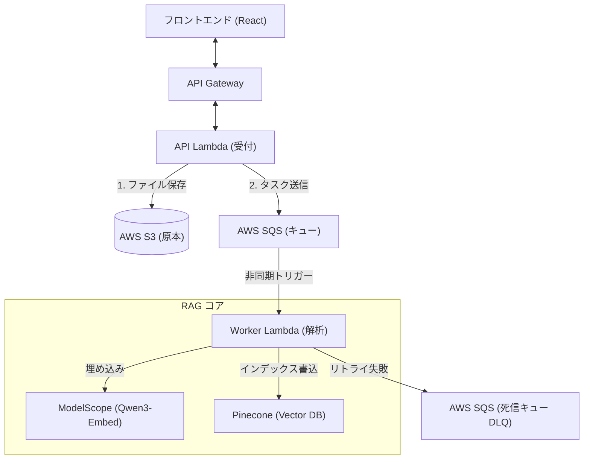
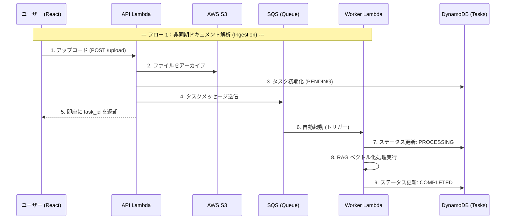
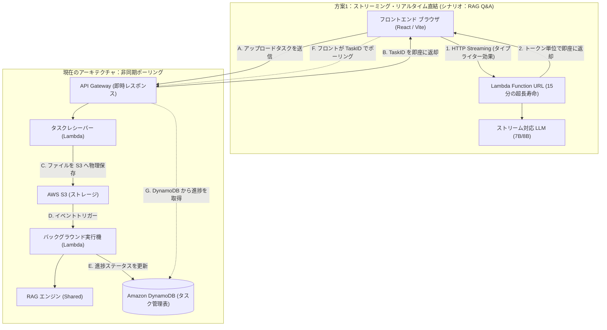

# プロジェクト開発計画: AWS ベースの NotebookLM 代替アプリ (クラウドネイティブ統合版)

*[🇨🇳 中文版 (Chinese Version) はこちら](./implementation_plan.md)*

目的: NotebookLM に似た個人用ナレッジベース Q&A ツール (RAG システム) を開発する。
コア戦略: **インフラストラクチャ (ストレージ、コンピューティング、フロントエンド) は、すべてワンストップで AWS ネイティブサービスを直接採用する。** しかし、コストに最も敏感な「モデル推論」と「ベクトルデータベース」の 2 つの領域では、コード内に双方向アダプター (Toggle) を内蔵し、設定パラメータを通じて無料版と高価な純粋 AWS 版をシームレスに切り替え可能にする。

#### 1. 静的インフラストラクチャ構成図 (依存関係)



#### 2. システムデータフロー図 (SQS ロードレベリング)


    Note over U, R: --- 2. 同期の対話・検索 (Sync Q&A) ---
    U->>A: A. 質問を送信 (POST /api/chat)
    A->>R: B. RAG チェーンの実行 (検索 -> 生成)
    R-->>A: C. 回答のサマリーを返却
    A-->>U: D. 即座に回答を表示 (約 5-15秒)

### コアコンポーネントの説明
1. **フロントエンド (Amplify + React/Vite)**: ドキュメントのアップロードとチャットインターフェイスのためのUIを提供。
2. **バックエンドロジック (API Gateway + Lambda)**: ステートレスな HTTP API を提供。Lambda 内の LangChain 統合が、テキストのドキュメント解析、チャンキング、ベクトル化、RAG 推論ロジックを担当。
3. **長期ストレージ (S3)**: S3 はユーザーがアップロードした PDF やドキュメントファイルのアーカイブ維持に使用。
4. **アダプター層による柔軟な切り替え**: プロジェクト固有の `Service Adapter Pattern` を適用。`.env` に `LLM_PROVIDER=modelscope` を指定するだけで低コスト構成が動作。

---

## 3. コスト見積もりと請求保護 (防超支估算)

免流構成の手順完了後、**モデル側を無料のオープンソース SaaS（ModelScope および Pinecone）へ分離する** アーキテクチャを採用しているため、当プロジェクトは AWS のネイティブクラウド上に構築されているものの、現在利用されているコンポーネントは**1年目/永久的無料枠 (Free Tier) に収まっています**：

- **AWS Amplify (CDN フロントエンドホスティング)**: アセットの高速グローバルロード。毎月 15GB までのデータ転送が無料。
- **Amazon API Gateway v2**: 最初の 100 万回/月の API 呼び出しが無料。開発テスト期間中の費用は `$0` に固定されます。
- **AWS Lambda (Python 3.12 計算層)**: 月あたり 40 万 GB-秒の巨大なコンピューティング枠が無料で提供されます。Embedding の操作が 20 秒に達するような重い処理に遭遇しても十分なリソースです。
- **Amazon S3**: 保存容量が 5GB 未満であれば `$0`。

**最終結論：高額な純正 AWS アーキテクチャ (OpenSearch Serverless や Bedrock) へ環境変数で意図的に切り替えない限り、現在のシステムの毎月の維持費用は完全に `$0` に抑えられます。**

---

## 4. 最新のリソース準備と設定ガイド (環境構築マニュアル)

このプロジェクトをスムーズに稼働させるには、以下 3 つの主要な基盤アクセス認証と環境準備が必要です：

1.  **自動デプロイメント用 AWS IAM 資格情報の取得**
    *   AWS IAM コンソールにアクセスし、プログラムアクセス用のユーザー（例: `notebooklm-dev-user`）を作成します。
    *   `AdministratorAccess` を付与します（API Gateway のシームレスな作成や CloudFormation トリガーを保証するため）。
    *   発行される **`AWS_ACCESS_KEY_ID`** と **`AWS_SECRET_ACCESS_KEY`**、そして `AWS_REGION` を安全に保管します。
    
2.  **ModelScope プラットフォームの API アクセス認証**
    *   Aliyun または ModelScope コミュニティのアカウントを登録・ログインします。
    *   コンソールで長期有効な **`MODELSCOPE_API_KEY`** を生成し、オープンソースモデルを無制限に利用可能にします。
    
3.  **Pinecone ベクトルデータベースの初期インデックス作成**
    *   無料の Pinecone SaaS アカウントを登録します。
    *   管理画面で新しいインデックスを作成します。**要件**: Qwen3-Embedding-8B の仕様に厳密に合わせるため、**Dimension (次元数) を `4096` に指定**し、Metric に `cosine` を選択します。
    *   API Keys メニューから **`PINECONE_API_KEY`**、および作成したインデックス名 **`PINECONE_INDEX`** を取得します。

これらの環境変数/シークレット値は、GitHub の **Settings -> Secrets and variables -> Actions** にすべて設定することで、完全に自動化された CI/CD パイプラインが機能し始めます。

---

## 5. CI/CD デプロイメント・トポロジー (フロントエンド/バックエンド分離)

フロントエンドとバックエンドの役割が大きく異なるため、本プロジェクトでは「デュアルパイプライン」のアプローチを採用しています：

#### 1. フロントエンドの自動化: AWS Amplify (目に見えない Webhook)
フロントエンド (React アプリ) は `.github/workflows` 経由ではデプロイされません。最新の **AWS Amplify** のネイティブな Webhook ホスティングに任せています：
- バックグラウンド動作：AWS Amplify アプリ作成時に、GitHub のリポジトリ `aws_notebooklm` に Amplify が直接接続します。
- トリガー：`main` ブランチに `git push` が発生するたびに、GitHub から AWS に対して安全な Webhook が送信されます。
- クリーンルームビルド：通知を受けた AWS Amplify は専用のコンテナ内で源码をクローンし、`npm run build` を実行して、ビルド済みの HTML 成果物を AWS 世界各地の CDN に配置します。

#### 2. バックエンドの自動化: GitHub Actions + Serverless Framework
FastAPI サーバー、Boto3、およびメガバイト単位の大規模な依存関係モジュールの配置は非常に複雑なため、GitHub Actions による厳格なパイプラインを使用しています：
- `.github/workflows/backend-deploy.yml` により、Ubuntu および Python 3.12 システムが組み込まれた GitHub ランナーを強制起動します。
- `backend/` フォルダに変更があった場合のみ発火します。
- ランナーは、GitHub Secrets から提供された `AWS_ACCESS_KEY` を適用し、最高のコンテナデプロイツールである **`Serverless Framework`** を呼び出します。独自の `serverless.yml` 構成に基づき、AWS の上限要件を回避しつつ Lambda 内へ効率よくパッケージ・コードを注入します。

---

## 6. コアプロジェクトのディレクトリ構造

```text
aws_notebooklm/
├── frontend/                     # AWS Amplify によりホストされる React フロントエンド
│   ├── src/
│   │   ├── App.tsx               # ⭐ UI レンダリング、チャット、状態管理の神経中枢
│   │   ├── App.css / index.css   # グラスモーフィズム UI およびレスポンシブデザインの CSS
│   │   ├── i18n.ts               # 日中多言語切り替え (react-i18next) 設定
│   │   └── main.tsx              # React レンダリング・エントリー
│   ├── package.json              # Vite と関連 SDK 依存関係をロック
│   └── vite.config.ts            # バンドラ構成と AWS 環境変数の読み込み設定
├── backend/                      # AWS Lambda にデプロイされる FastAPI エンジン
│   ├── app.py                    # ⭐ バックエンド中枢：アップロード、チャンキング、RAG推論ルートを管理
│   ├── adapters.py               # デュアル対応用ファクトリ層。ModelScope と Bedrock 等の制御を定義
│   ├── serverless.yml            # CI/CD 用デプロイメント構成 (3.12 ランタイムと上限回避ロック)
│   └── requirements.txt          # Python アプリケーション・RAG ライブラリのバージョンロック
├── README.md                     # メインの日本語説明書
├── README_zh.md                  # 中国語の説明書
├── implementation_plan.md        # 核心実装計画と作業実績報告 (中)
└── implementation_plan_ja.md     # 核心実装計画と作業実績報告 (日)
```

---

## 7. アップグレードと改善の TODO リスト (次世代アーキテクチャの進化)

システムの複雑さが増すにつれ、現在の極端にシンプルな Serverless アーキテクチャは、将来的にエンタープライズレベルでの進化が必要になります。以下は、コア機能とインフラストラクチャに関する改善 TODO リストです：

### 7.1 自動化テスト防御線の導入 (Automated Testing CI/CD)
現在の手動検証と TypeScript の静的型チェックに代わり、CI/CD パイプラインに厳格な自動テストのハードルを追加します。
- **バックエンド (Pytest)**: GitHub Actions の `Serverless deploy` アクションの前に `pytest` を強制実行します。モックオブジェクトを使用して、S3 アップロード、Pinecone 書き込み、LLM のレスポンスフォーマットの単体テストを徹底します。
- **フロントエンド (Vitest)**: AWS Amplify のビルド構成の `npm run build` フェーズの前にコンポーネントテストを追加し、多言語 UI や HTTP 500 クライアントエラーのトースト表示の安定性を保証します。

### 7.2 ハイブリッド・アーキテクチャの導入 (Hybrid Architecture)
AWS API Gateway の 29 秒という過酷なタイムアウト上限を突破しつつ、「リアルタイムチャット」と「重い長文レポート生成」の両方を完全にサポートするため、ルーティングを 2 系統のハイブリッドに再設計します。



**アーキテクチャ進化によるメリット**:
1.  **究極の UX**: 方案1 では、Function URL を活用して API Gateway を回避し、ChatGPT のような文字単位でのリアルタイムストリーミング出力 (SSE) を RAG システムに提供します。
2.  **堅牢性とスケーラビリティ**: 方案2 では、時間がかかるタスクを SQS によってトラフィックシェーピングし、API Gateway のタイムアウトエラーに悩まされることなく、フロントエンドに進行状況バーを表示できるようになります。

### 7.3 マルチターン対話コンテキストの強化 (Conversational Memory & Query Rewriting)
現在のシステムは単一ターン（Single-turn）の Q&A です。AI が「彼」や「翌日」などの代名詞を含むフォローアップの質問を正確に理解できるようにするため、`/api/chat` の RAG 検索チェーンを再構築します：
1.  **記憶の永続化**: グローバルな `SessionID` を導入し、予約済みの Amazon DynamoDB を利用して過去の N ターンの対話履歴を保存します。
2.  **クエリの書き換え (Query Rewriting)**: Pinecone のベクトル検索を実行する前に、最初の超高速な LLM 前処理フェーズを追加します。履歴コンテキストを利用して「不完全なフォローアップ質問」を「独立した完全な質問」に補完し（代名詞の解消）、正確なナレッジチャンクにヒットすることを保証します。
3.  **最終 Prompt 合成**: 質問応答コアチェーンを送信する際、補完された独立したクエリ、ヒットしたベクトルスライス、および直近の `Chat History` をまとめて主力推論モデルに送信します。

## 9. AWS Bedrock 全管理型ナレッジベース (Managed RAG) 
「マネージドサービスを練習したいが、コストも抑制したい」というニーズに基づき、アーキテクチャに「制御型ラボモード」を導入します。

### 9.1 コアアーキテクチャ (S3 -> Bedrock KB -> Pinecone)
*   **ベクトルエンジン**: Bedrock Knowledge Base (KB) は、バックエンドとして Pinecone を完全にサポートしています。
*   **埋め込みモデル**: **Titan Text Embeddings v2** を使用します（1024 次員の出力をサポートしており、既存の Qwen インデックスと物理的な次元数を合わせることが可能ですが、ベクトル空間は互換性がありません）。
*   **自動同期**: Lambda でのチャンク分割コードを手書きする必要がなく、S3 が更新されると Ingestion Job をトリガーするだけで自動的に解析・同期されます。

### 9.2 コスト防御ロジック (プラクティスガイド)
*   **KB 管理費**: 約 $0.19/時間。
*   **戦略**:
    *   **オンデマンド作成**: 練習やデバッグ期間中のみ KB リソースを作成します。
    *   **迅速な削除**: 練習が終わった際や休憩前には、**直ちにコンソールまたはスクリプトから Knowledge Base リソースを削除**してください。KB リソースを削除しても、S3 のファイルと Pinecone のデータは保持されます。次回の練習時には、同じ場所を指す KB を再作成するだけで済みます。
    *   **並列インデックス**: 埋め込みモデルが異なるとベクトルが通用しないため、Pinecone の管理画面で新しい Namespace を作成するか、練習用に別のインデックス（別アカウントを推奨）を使用することを強くお勧めします。

### 9.3 デュアルモード切り替えの実装
`adapters.py` と `app.py` に `RETRIEVER_MODE` 環境変数を導入し、「ワンクリックでの切り替え」を実現します。
- `MANUAL` (デフォルト): カスタム Lambda チャンカー + ModelScope 埋め込み。
- `BEDROCK_KB`: `AmazonKnowledgeBasesRetriever` を介して AWS ネイティブの検索インターフェースを呼び出し。

## 10. Ingestion の自動化とパフォーマンス最適化 (最新の進捗)

開発・運用体験を向上させるため、RAG ワークフローに自動化フックとタイムアウト防止ロジックを導入しました。

### 10.1 「アップロード即同期」の自動化
*   **ロジック**: `app.py` のドキュメントアップロード API において、モードが `BEDROCK_KB` の場合、自動的に `DATA_SOURCE_ID` を取得し、`bedrock-agent` の `start_ingestion_job` を実行します。
*   **結果**: ユーザーは AWS コンソールで「同期 (Sync)」ボタンをクリックする必要がなくなり、ドキュメントがアップロードされた直後に検索可能になります。

### 10.2 29秒タイムアウト防御戦略
*   **課題**: API Gateway の 29 秒というハードリミットと、比較的低速な埋め込みモデル（ModelScope）を一つのリクエスト内で処理するとタイムアウトが発生しやすい。
*   **対策**:
    *   **KB モード**: ローカルでの Embedding 処理をスキップし、S3 へのアップロードと軽量な同期リクエストのみを実行します。これによりレスポンスが 90% 以上高速化されました。
    *   **Manual モード**: 小規模なファイルに限定。将来的には S3 トリガーによる非同期 Lambda への移行を推奨。

### 10.3 主要な環境変数の一覧
GitHub Secrets/Variables で以下の設定が必要です：
- `RETRIEVER_MODE`: `BEDROCK_KB` または `MANUAL`
- `KNOWLEDGE_BASE_ID`: Bedrock ナレッジベース ID
- `DATA_SOURCE_ID`: S3 データソース ID

### 5. コアアーキテクチャ：非同期ポーリングと SQS ロードレベリング
高負荷時の安定性を確保し、再試行メカニズムを強化するため、システムは **S3 + SQS** のハイブリッド構成にアップグレードされました：
- **API 受信層**：FastAPI がファイルを受け取り、S3 に保存後、**SQS (TasksQueue)** へメッセージを送信し、即座に応答を返します。
- **メッセージ緩衝層**：SQS がタスクを永続化し、「バッファ」として機能することで、突発的な大量アップロードによる Lambda の過負荷を防ぎます。
- **バックエンド処理層**：専用の Lambda が SQS からメッセージを 1 つずつ取得し、RAG 解析を実行します。異常時には自動で指数バックオフによる再試行が行われます。
- **フロントエンド同期層**：React が `GET /api/tasks/{id}` を定期的にポーリングし、進捗を UI に反映します。

詳細な設計図についてはこちらを参照：[🏗️ 非同期 RAG アーキテクチャの全容解析](./aws_asynchronous_rag_architecture.md)

---

### 今日の開発記録：トラブルと解決策 🐛
のまとめ (Serverless RAG 実務経験)

プロジェクト初期の開発において、AWS Lambda アーキテクチャに特有の以下の技術的課題に遭遇し、解決しました：

### 8.1 AWS Lambda 実行環境の制限
*   **SHM (共有メモリ) 欠如によるクラッシュ**:
    *   **現象**: `langchain-pinecone` のデフォルトの `add_documents` を使用すると、バックグラウンドで `multiprocessing.ThreadPool` が呼び出され、`SemLock` の作成に失敗してエラーが発生する。
    *   **解決策**: 抽象化ライブラリをバイパスし、**完全同期（Serial）**の Pinecone HTTP Upsert ロジックを自作することで、並列処理の競合を根本的に回避。
*   **読み取り専用ファイルシステムとの競合**:
    *   **現象**: `tiktoken` がデフォルトで Lambda の読み取り専用 `$HOME` ディレクトリにキャッシュを作成しようとする。
    *   **解決策**: 環境変数を使用して `TIKTOKEN_CACHE_DIR` を唯一書き込み可能な `/tmp` 領域に強制的にリダイレクト。

### 8.2 API Gateway 29秒タイムアウトの壁
*   **現象**: 巨大なパラメータを持つ LLM (例: 122B モデル) を呼び出すと、推論時間が API Gateway の 29 秒というハードリミットに達しやすい。
*   **解決策**: 現在は 8B クラスの高レスポンスモデルで対応。長期的には **Lambda Function URL** (最大 15 分) または **SQS 非同期モード** への切り替えを計画。

### 8.3 RAG 検索の精度（再現率）の最適化
*   **次元数とモデルのミスマッチ**:
    *   **課題**: 生成型 LLM をベクトル化に誤用し（次元数は高いが意味的に希薄）、データベースに原文があるのに検索にヒットしない。
    *   **解決策**: **対照学習専用モデル** `Qwen3-Embedding-0.6B` に切り替え、**1024次元** という黄金比の次元数に固定。
*   **コンテキストの断絶 (Multi-hop Failure)**:
    *   **現象**: PDF 内の「規則」と、それに対応する「表」が物理的に離れている場合、小さなチャンクサイズではそれらが分割され、AI が関連付けた推論ができなくなる。
    *   **解決策**: `chunk_size` を **3000** に大幅に拡大し、1ページ内の論理的なつながりが同一ベクトル内に高度に集約されるように調整。
