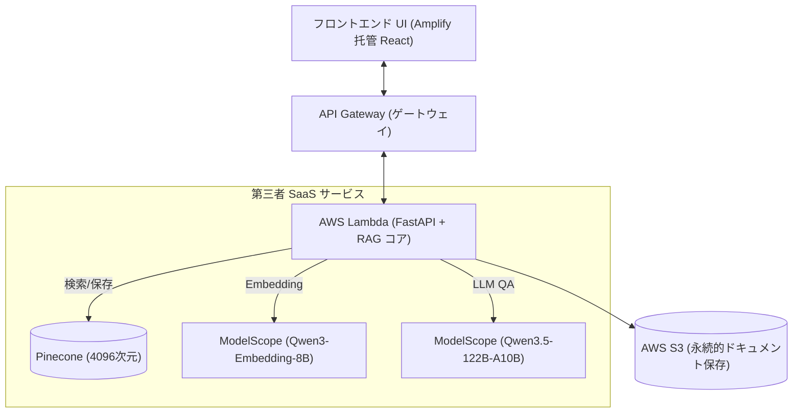

# プロジェクト開発計画: AWS ベースの NotebookLM 代替アプリ (クラウドネイティブ統合版)

*[🇨🇳 中文版 (Chinese Version) はこちら](./implementation_plan.md)*

目的: NotebookLM に似た個人用ナレッジベース Q&A ツール (RAG システム) を開発する。
コア戦略: **インフラストラクチャ (ストレージ、コンピューティング、フロントエンド) は、すべてワンストップで AWS ネイティブサービスを直接採用する。** しかし、コストに最も敏感な「モデル推論」と「ベクトルデータベース」の 2 つの領域では、コード内に双方向アダプター (Toggle) を内蔵し、設定パラメータを通じて無料版と高価な純粋 AWS 版をシームレスに切り替え可能にする。

## 1. 展開アーキテクチャ図（依存関係ビュー）



## 2. コア基盤とデータフロー (RAG ワークフロー)

以下のシーケンス/フローチャートは、「アップロードとインデックス作成」および「検索とレスポンス生成」の 2 つの主要なプロセスで、データがどのように流れるかを明確に示しています。

```mermaid
graph TD
    UI[フロントエンド]
    APIGW[API_Gateway_入口]
    Lambda[AWS_Lambda_クラスター]
    S3[(Amazon_S3_ストレージ)]
    Pinecone[(Pinecone_ベクトルDB)]
    ModelScopeE[魔搭_Embeddingエンジン]
    ModelScopeL[魔搭_LLMブレイン]

    %% Ingestion Flow (インデックス作成)
    UI -- 1. ソースドキュメントをアップロード --> APIGW
    APIGW -- 2. ペイロードを転送 --> Lambda
    Lambda -- 3. 原本を永続保存 --> S3
    Lambda -- 4. テキストチャンクを送信 --> ModelScopeE
    ModelScopeE -- 5. 4096次元の高次元ベクトルを返す --> Lambda
    Lambda -- 6. チャンクとベクトルを紐付けて保存 --> Pinecone

    %% Q&A Flow (検索)
    UI -. A. 自然言語の質問を送信 .-> APIGW
    APIGW -. B. 質問をルーティング .-> Lambda
    Lambda -. C. 質問をエンコード用に送信 .-> ModelScopeE
    ModelScopeE -. D. クエリベクトルを取得 .-> Lambda
    Lambda -. E. ベクトルを基に類似度検索 .-> Pinecone
    Pinecone -. F. 高精度な関連パラグラフを返却 .-> Lambda
    Lambda -. G. プロンプトとコンテキストをまとめ推論へ .-> ModelScopeL
    ModelScopeL -. H. テキストに基づいて回答を生成 .-> Lambda
    Lambda -. I. フロントエンドに即座に出力 .-> UI
```

### コアコンポーネントの説明
1. **フロントエンド (Amplify + React/Vite)**: ドキュメントのアップロードとチャットインターフェイスのためのUIを提供。
2. **バックエンドロジック (API Gateway + Lambda)**: ステートレスな HTTP API を提供。Lambda 内の LangChain 統合が、テキストのドキュメント解析、チャンキング、ベクトル化、RAG 推論ロジックを担当。
3. **長期ストレージ (S3)**: S3 はユーザーがアップロードした PDF やドキュメントファイルのアーカイブ維持に使用。
4. **アダプター層による柔軟な切り替え**: プロジェクト固有の `Service Adapter Pattern` を適用。`.env` に `LLM_PROVIDER=modelscope` を指定するだけで低コスト構成が動作。

---

## 3. コスト見積もりと請求保護 (防超支估算)

免流構成の手順完了後、**モデル側を無料のオープンソース SaaS（ModelScope および Pinecone）へ分離する** アーキテクチャを採用しているため、当プロジェクトは AWS のネイティブクラウド上に構築されているものの、現在利用されているコンポーネントは**1年目/永久的無料枠 (Free Tier) に収まっています**：

- **AWS Amplify (CDN フロントエンドホスティング)**: アセットの高速グローバルロード。毎月 15GB までのデータ転送が無料。
- **Amazon API Gateway v2**: 最初の 100 万回/月の API 呼び出しが無料。開発テスト期間中の費用は `$0` に固定されます。
- **AWS Lambda (Python 3.12 計算層)**: 月あたり 40 万 GB-秒の巨大なコンピューティング枠が無料で提供されます。Embedding の操作が 20 秒に達するような重い処理に遭遇しても十分なリソースです。
- **Amazon S3**: 保存容量が 5GB 未満であれば `$0`。

**最終結論：高額な純正 AWS アーキテクチャ (OpenSearch Serverless や Bedrock) へ環境変数で意図的に切り替えない限り、現在のシステムの毎月の維持費用は完全に `$0` に抑えられます。**

---

## 4. 最新のリソース準備と設定ガイド (環境構築マニュアル)

このプロジェクトをスムーズに稼働させるには、以下 3 つの主要な基盤アクセス認証と環境準備が必要です：

1. **自動デプロイメント用 AWS IAM 資格情報の取得**
   - AWS IAM コンソールにアクセスし、プログラムアクセス用のユーザー（例: `notebooklm-dev-user`）を作成します。
   - `AdministratorAccess` を付与します（API Gateway のシームレスな作成や CloudFormation トリガーを保証するため）。
   - 発行される **`AWS_ACCESS_KEY_ID`** と **`AWS_SECRET_ACCESS_KEY`**、そして `AWS_REGION` を安全に保管します。
   
2. **ModelScope プラットフォームの API アクセス認証**
   - Aliyun または ModelScope コミュニティのアカウントを登録・ログインします。
   - コンソールで長期有効な **`MODELSCOPE_API_KEY`** を生成し、オープンソースモデルを無制限に利用可能にします。
   
3. **Pinecone ベクトルデータベースの初期インデックス作成**
   - 無料の Pinecone SaaS アカウントを登録します。
   - 管理画面で新しいインデックスを作成します。**要件**: Qwen3-Embedding-8B の仕様に厳密に合わせるため、**Dimension (次元数) を `4096` に指定**し、Metric に `cosine` を選択します。
   - API Keys メニューから **`PINECONE_API_KEY`**、および作成したインデックス名 **`PINECONE_INDEX`** を取得します。

これらの環境変数/シークレット値は、GitHub の **Settings -> Secrets and variables -> Actions** にすべて設定することで、完全に自動化された CI/CD パイプラインが機能し始めます。

---

## 5. CI/CD デプロイメント・トポロジー (フロントエンド/バックエンド分離)

フロントエンドとバックエンドの役割が大きく異なるため、本プロジェクトでは「デュアルパイプライン」のアプローチを採用しています：

#### 1. フロントエンドの自動化: AWS Amplify (目に見えない Webhook)
フロントエンド (React アプリ) は `.github/workflows` 経由ではデプロイされません。最新の **AWS Amplify** のネイティブな Webhook ホスティングに任せています：
- バックグラウンド動作：AWS Amplify アプリ作成時に、GitHub のリポジトリ `aws_notebooklm` に Amplify が直接接続します。
- トリガー：`main` ブランチに `git push` が発生するたびに、GitHub から AWS に対して安全な Webhook が送信されます。
- クリーンルームビルド：通知を受けた AWS Amplify は専用のコンテナ内で源码をクローンし、`npm run build` を実行して、ビルド済みの HTML 成果物を AWS 世界各地の CDN に配置します。

#### 2. バックエンドの自動化: GitHub Actions + Serverless Framework
FastAPI サーバー、Boto3、およびメガバイト単位の大規模な依存関係モジュールの配置は非常に複雑なため、GitHub Actions による厳格なパイプラインを使用しています：
- `.github/workflows/backend-deploy.yml` により、Ubuntu および Python 3.12 システムが組み込まれた GitHub ランナーを強制起動します。
- `backend/` フォルダに変更があった場合のみ発火します。
- ランナーは、GitHub Secrets から提供された `AWS_ACCESS_KEY` を適用し、最高のコンテナデプロイツールである **`Serverless Framework`** を呼び出します。独自の `serverless.yml` 構成に基づき、AWS の上限要件を回避しつつ Lambda 内へ効率よくパッケージ・コードを注入します。

---

## 6. コアプロジェクトのディレクトリ構造

```text
aws_notebooklm/
├── frontend/                     # AWS Amplify によりホストされる React フロントエンド
│   ├── src/
│   │   ├── App.tsx               # ⭐ UI レンダリング、チャット、状態管理の神経中枢
│   │   ├── App.css / index.css   # グラスモーフィズム UI およびレスポンシブデザインの CSS
│   │   ├── i18n.ts               # 日中多言語切り替え (react-i18next) 設定
│   │   └── main.tsx              # React レンダリング・エントリー
│   ├── package.json              # Vite と関連 SDK 依存関係をロック
│   └── vite.config.ts            # バンドラ構成と AWS 環境変数の読み込み設定
├── backend/                      # AWS Lambda にデプロイされる FastAPI エンジン
│   ├── app.py                    # ⭐ バックエンド中枢：アップロード、チャンキング、RAG推論ルートを管理
│   ├── adapters.py               # デュアル対応用ファクトリ層。ModelScope と Bedrock 等の制御を定義
│   ├── serverless.yml            # CI/CD 用デプロイメント構成 (3.12 ランタイムと上限回避ロック)
│   └── requirements.txt          # Python アプリケーション・RAG ライブラリのバージョンロック
├── README.md                     # メインの日本語説明書
├── README_zh.md                  # 中国語の説明書
├── implementation_plan.md        # 核心実装計画と作業実績報告 (中)
└── implementation_plan_ja.md     # 核心実装計画と作業実績報告 (日)
```

---

## 7. アップグレードと改善の TODO リスト (次世代アーキテクチャの進化)

システムの複雑さが増すにつれ、現在の極端にシンプルな Serverless アーキテクチャは、将来的にエンタープライズレベルでの進化が必要になります。以下は、コア機能とインフラストラクチャに関する改善 TODO リストです：

### 7.1 自動化テスト防御線の導入 (Automated Testing CI/CD)
現在の手動検証と TypeScript の静的型チェックに代わり、CI/CD パイプラインに厳格な自動テストのハードルを追加します。
- **バックエンド (Pytest)**: GitHub Actions の `Serverless deploy` アクションの前に `pytest` を強制実行します。モックオブジェクトを使用して、S3 アップロード、Pinecone 書き込み、LLM のレスポンスフォーマットの単体テストを徹底します。
- **フロントエンド (Vitest)**: AWS Amplify のビルド構成の `npm run build` フェーズの前にコンポーネントテストを追加し、多言語 UI や HTTP 500 クライアントエラーのトースト表示の安定性を保証します。

### 7.2 ハイブリッド・アーキテクチャの導入 (Hybrid Architecture)
AWS API Gateway の 29 秒という過酷なタイムアウト上限を突破しつつ、「リアルタイムチャット」と「重い長文レポート生成」の両方を完全にサポートするため、ルーティングを 2 系統のハイブリッドに再設計します。

```mermaid
graph TD
    Client["フロントエンド ブラウザ (React / Vite)"]
    
    subgraph 方案1：ストリーミング・リアルタイム直結 (シナリオ：RAG Q&A)
        Client -- "1. HTTP Streaming (タイプライター効果)" --> LambdaURL["Lambda Function URL (15分の超長寿命)"]
        LambdaURL -- "2. トークン単位で即座に返却" --> Client
        LambdaURL --> LLM_Fast["ストリーム対応 LLM (7B/8B)"]
    end
    
    subgraph 方案2：非同期キューポーリング (シナリオ：長文レポートの生成)
        Client -- "A. レポート生成ジョブを投入" --> APIGW["API Gateway (29秒タイムアウト)"]
        APIGW -- "B. システムが瞬時に Task_ID を返す" --> Client
        APIGW --> Lambda_API["FastAPI 受信サーバー"]
        Lambda_API -- "C. 重いジョブをキューに投げる" --> SQS["AWS SQS メッセージキュー (非同期バッファ)"]
        SQS -- "D. バックグラウンドで順次消費" --> Lambda_Worker["裏方 Lambda ワーカー"]
        Lambda_Worker --> LLM_Heavy["超巨大パラメータモデル (122B)"]
        Lambda_Worker -- "E. 生成完了後、結果を保存" --> DynamoDB[("Amazon DynamoDB (結果テーブル)")]
        Client -. "F. Task_ID を用いてポーリング" .-> APIGW
        APIGW -. "G. DynamoDB から状況・結果を照会" .-> DynamoDB
    end
```

**アーキテクチャ進化によるメリット**:
1. **究極の UX**: 方案1 では、Function URL を活用して API Gateway を回避し、ChatGPT のような文字単位でのリアルタイムストリーミング出力 (SSE) を RAG システムに提供します。
2. **堅牢性とスケーラビリティ**: 方案2 では、時間がかかるタスクを SQS によってトラフィックシェーピングし、API Gateway のタイムアウトエラーに悩まされることなく、フロントエンドに進行状況バーを表示できるようになります。
